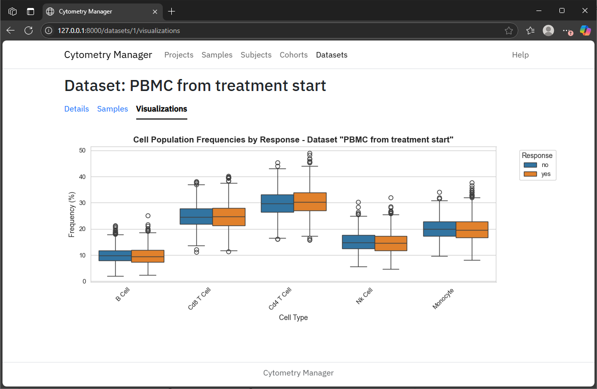

# cytometry-manager

Cytometry manager is an app for managing and analyzing cytometry data.
It is designed to provide a convenient way to organize samples into groups to facilitate various analyses.
Cytometry manager is written exclusively in Python, although it implements a React frontend by the magic of [FastUI](https://github.com/pydantic/FastUI), with a [FastAPI](https://fastapi.tiangolo.com/) backend.

## Installation

This app was developed using Python 3.13 on Windows 11.
It has not been tested using other configurations.

**Installation steps:**
1. Create a Python virtual environment: `python -m venv venv`
2. Activate the venv: `venv\Scripts\Activate.ps1` (or equivalent).
3. Install dependencies: `pip install -r requirements.txt`

## Running the app

To run the app, make sure the venv is activated, then execute `run.py`: `python run.py`.
Once running, point your browser at http://127.0.0.1:8000 to load the UI.
Upon execution of `run.py`, if the database file is missing, the CSV file `cell-count.csv` will be loaded to populate the database.

## Usage

For help using the app, visit the help page by clicking the [link](http://127.0.0.1:8000/help/) in the UI navbar.

## Database schema

The app converts the rows in the csv into three separate entities: `Project`, `Sample` and `Subject`.
These entities are distinct, so they need their own tables.
Separating them out results in a smaller database when samples are associated with more than one project or subject.
Furthermore, treating these entities separately facilitates the manual entry of new data and the re-use and modification of existing instances.
Additionally, these and further entities such as `Cohort` and `Dataset` provide performance benefits when it comes to the complicated querying of large data that is necessary to curate the right data points for specific analyses.
Although the database schema is well-designed, database performance is only optimal to the extent that queries are written optimally.

## Cohorts and Datasets

Analyzing the cytometry data requires filtering available data points based on various criteria.
Cohorts and datasets were introduced to make this filtering simpler and more intuitive.
See the help page in the UI details on what cohorts and datasets are and what they are useful for.

## Screenshot

